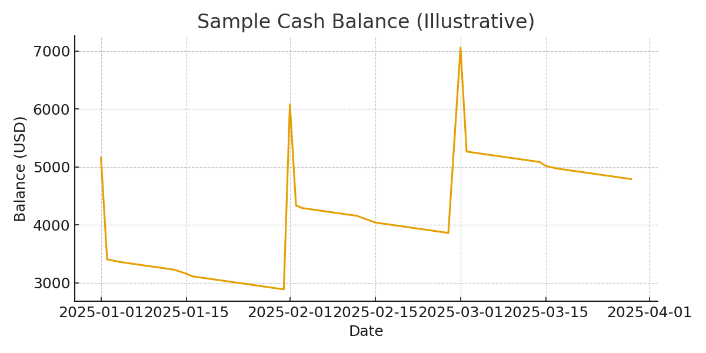

# Cash Flow Show

A sleek, portfolio-ready React + TypeScript app that ingests your bank transactions (CSV/XLSX), detects recurring inflows/outflows, and projects your cash balance. Built to impress hiring managers and technical reviewers with clean code, tests, and professional visuals.

## Features
- CSV/XLSX upload with robust parsing & normalization
- Recurring detection with **sensitivity** (strict/normal/loose) and a **review modal** to enable/disable series
- Forward projection to a chosen end date
- **Time buckets:** Daily, 3-days, Weekly, Biweekly, Monthly(30d)
- **Settings panel:** starting balance (USD), date range, detection sensitivity, bucket choice
- Persistent state (localStorage, client-only)
- Clean dark UI with Tailwind + DaisyUI
- Lightweight tests (Vitest) for core logic
- Sample dataset and screenshot



## Quick Start
```bash
pnpm i   # or npm i / yarn
pnpm dev # http://localhost:5173
```

## How to Use
1. Open the app and set **Starting Balance**, **Start/End** dates, and **Bucket**.
2. Upload one or more **CSV/XLSX** files (a sample is included at `public/sample-transactions.csv`).
3. Click **Detect Recurring** to see detected series; toggle any off and click **Done**.
4. Click **Apply Projection** to compute the cash curve and view the chart.
5. Review the **Transactions** table and the **Cash Balance** chart.

### File format
The parser supports common header names like `date`, `description`, `amount` (and several variants). Credits are positive, debits negative. Dates should be parseable; ambiguous dates are heuristically resolved when possible.

## Project Structure
- `src/utils/fileParser.ts` — robust CSV/XLSX parsing and normalization
- `src/utils/cashFlowCalculator.ts` — recurring detection, projection, bucketing, and balance curve
- `src/components/*` — UI building blocks (Uploader, Settings, Chart, Table, Review modal)
- `src/store/useAppStore.ts` — app state w/ localStorage persistence
- `src/pages/App.tsx` — composition and actions
- `src/types.ts` — type contracts

## Tests
```bash
pnpm test
```

## Loom-style Demo Script (2–3 minutes)
- **Intro (10s):** “This is *Cash Flow Show*, a lightweight, client-only cash projection tool I built with React, TypeScript, and Recharts.”
- **Upload (30s):** “I can drop CSV or Excel exports from my bank. I’ll use the included sample dataset.” (show `public/sample-transactions.csv`)
- **Settings (20s):** “Set a starting balance, date range, and bucket granularity—daily to monthly.”
- **Detect & Review (30s):** “Now I detect recurring series. A review modal lets me enable/disable entries.”
- **Project & Visualize (30s):** “Apply Projection computes a running balance; the chart marks where projections begin.”
- **Code Quality (20s):** “Parsing and projection live in tested, typed utilities. The UI is small, clean, and accessible—perfect for a portfolio.”
- **Close (10s):** “All state is localStorage-only—no backend.”

## License
MIT
